# Image Binarization Techniques with OpenCV

## Problem Statement and Goal of Project

This project explores fundamental image binarization techniques using OpenCV. The primary goal is to convert grayscale images into binary (black and white) images by applying various thresholding methods. This is a crucial preprocessing step in many computer vision tasks, as it simplifies image analysis by separating objects from the background. The notebook also serves as a practical demonstration of my ability to implement and explain these core concepts.

## Solution Approach

I implemented several thresholding techniques to demonstrate their effects on different types of images. The approaches include:

  * **Simple Binary Thresholding**: Manually setting a threshold value (e.g., 127) to segment the image. Pixels below this value are set to black (0), and pixels above are set to white (255).
  * **Otsu's Method for Automatic Thresholding**: An adaptive technique that automatically determines the optimal threshold value by analyzing the image's histogram to minimize intra-class variance.
  * **Interactive Thresholding Demo**: A user-friendly application with a trackbar to dynamically adjust the threshold value and type, providing immediate visual feedback on how these parameters affect the output.

## Technologies & Libraries

  * **OpenCV**: For core image processing and computer vision functionalities.
  * **NumPy**: For efficient numerical operations and array manipulation.
  * **Matplotlib**: For plotting and visualizing images within the notebook.

## Description about Dataset

The project uses a small set of sample images (`gradient.jpg`, `Lusin-1.jpg`, and `plate.jpg`) to illustrate the different thresholding methods. These images were chosen to showcase how each technique performs under varying conditions (e.g., gradients, real-world objects).

## Installation & Execution Guide

1.  **Clone the repository:**
    ```bash
    git clone https://github.com/imehranasgari/Image-Binarization-OpenCV.git
    ```
2.  **Install the required libraries:**
    ```bash
    pip install opencv-python numpy matplotlib
    ```
3.  **Run the Jupyter Notebook:**
    ```bash
    jupyter notebook binarization.ipynb
    ```

## Key Results / Performance

This project is intended to demonstrate conceptual understanding rather than achieving high performance metrics. The key results are the visual outputs that clearly show the differences between various thresholding methods. The inclusion of both manual and automatic (Otsu's) thresholding highlights my ability to select the appropriate tool for a given problem. The interactive demo further showcases my skills in creating practical, user-friendly applications.

## Screenshots / Sample Output
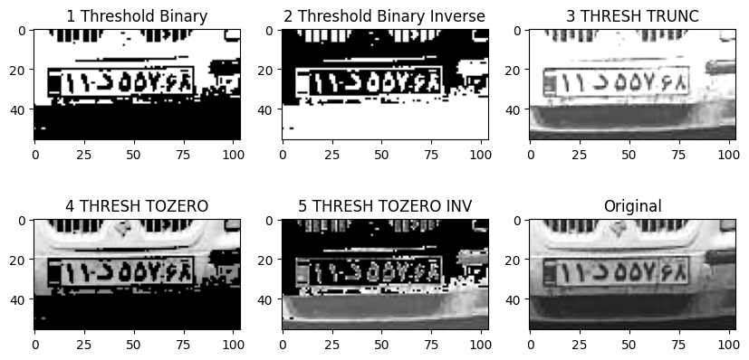
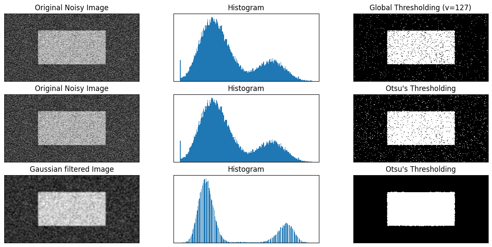
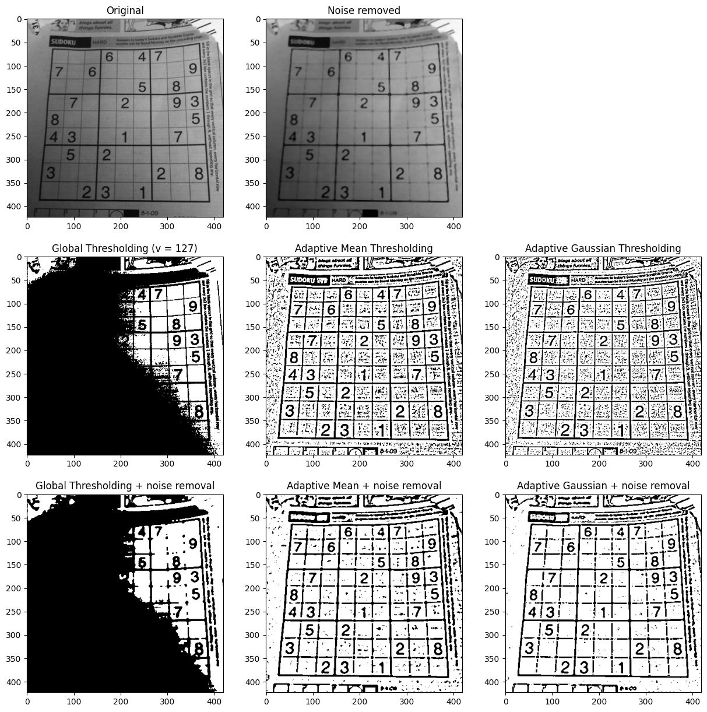
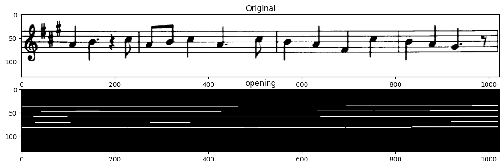
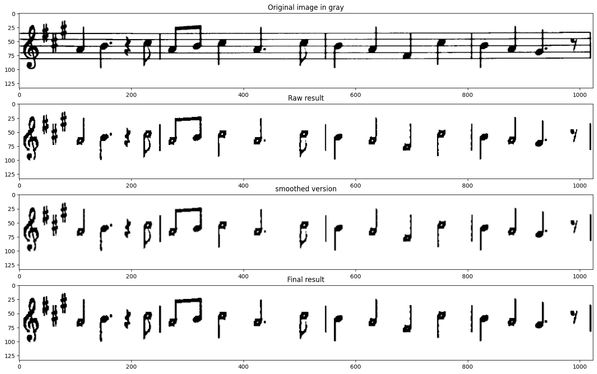
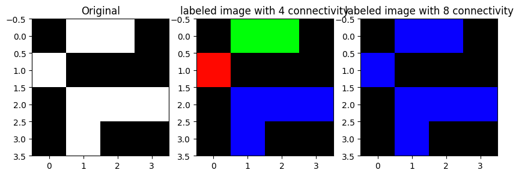
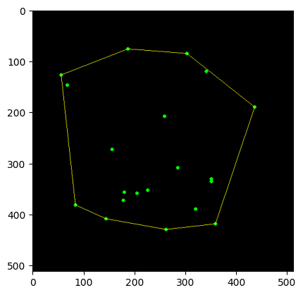
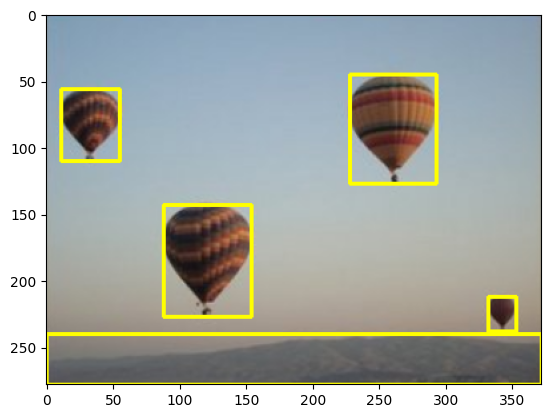
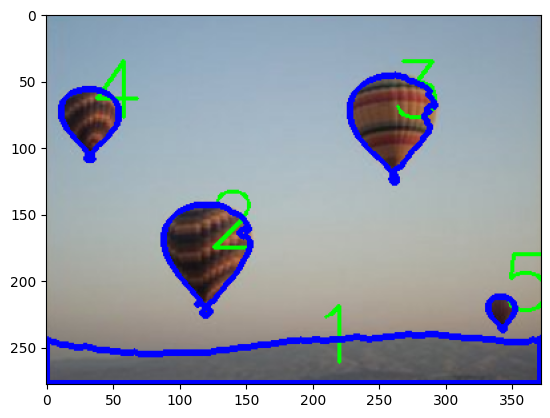
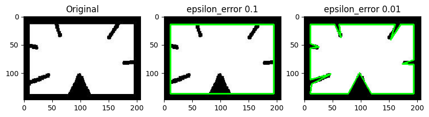
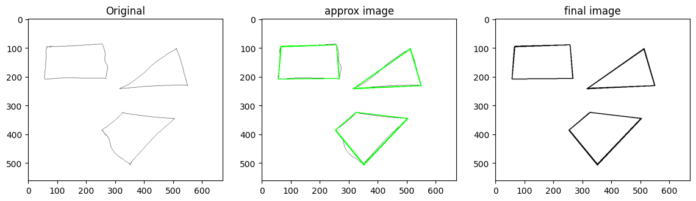
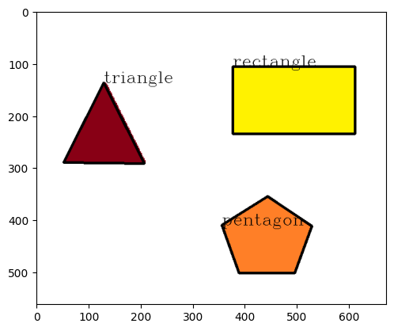
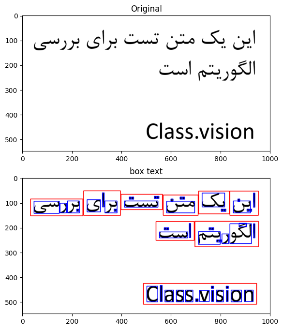
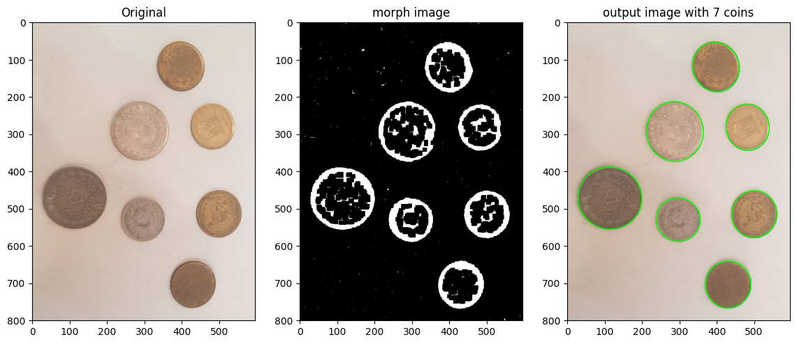
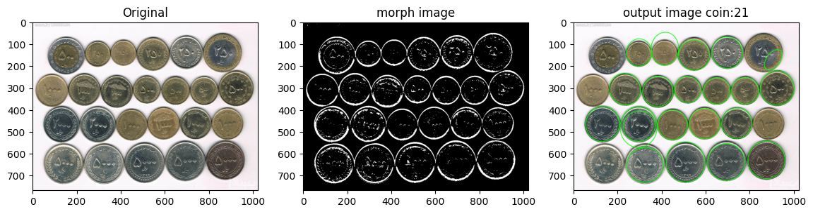
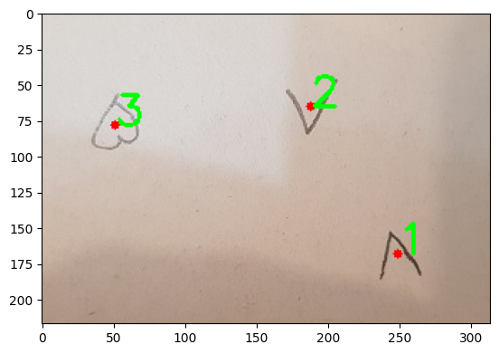
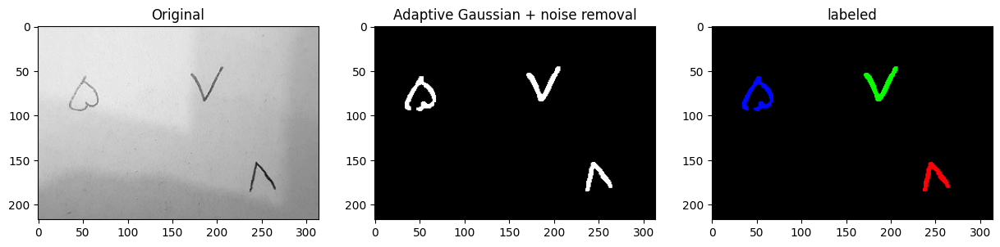
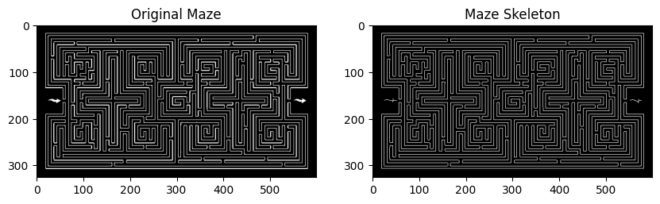
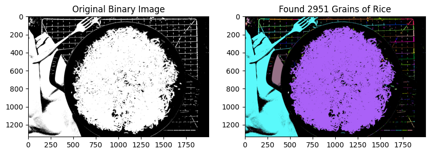
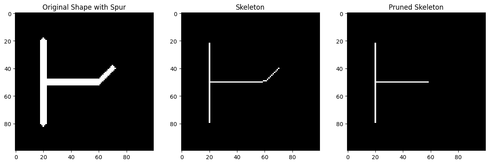
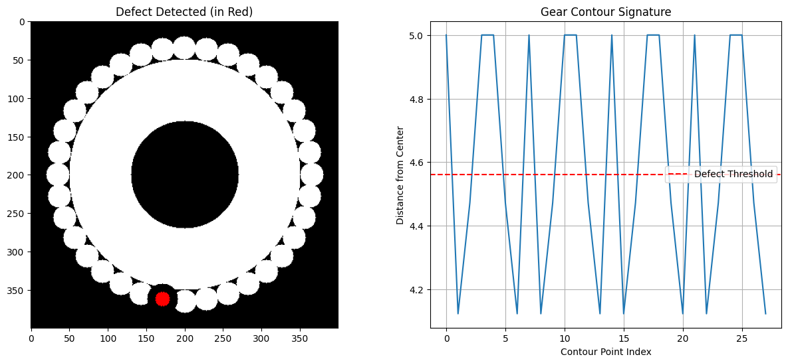


## Additional Learnings / Reflections

This project reinforced my understanding of image binarization as a critical first step in many computer vision pipelines, such as object detection and optical character recognition (OCR). By implementing both simple and adaptive thresholding methods, I gained a deeper appreciation for the trade-offs between manual control and automated, data-driven approaches like Otsu's method. This exploration serves as a solid foundation for tackling more complex image segmentation challenges.

-----

## 🙏 Acknowledgments

This project represents my initial steps into the practical application of computer vision. The foundational knowledge and guidance for this work were derived from the outstanding OpenCV course taught by **Alireza Akhavanpour** on the **Maktabkhooneh** platform. His ability to deconstruct complex topics into clear, actionable steps was instrumental in the successful implementation of this project.

-----


## 👤 Author

## Mehran Asgari

## **Email:** [imehranasgari@gmail.com](mailto:imehranasgari@gmail.com).

## **GitHub:** [https://github.com/imehranasgari](https://github.com/imehranasgari).

-----

## 📄 License

This project is licensed under the Apache 2.0 License – see the `LICENSE` file for details.

💡 *Some interactive outputs (e.g., plots, widgets) may not display correctly on GitHub. If so, please view this notebook via [nbviewer.org](https://nbviewer.org) for full rendering.*

-----
